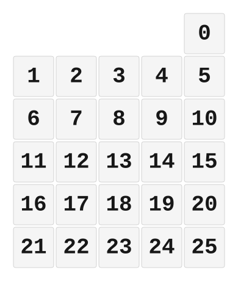

# ZMK Configuration for numpad123-5x5

*Generated by Shield Wizard for ZMK*



Download compiled firmware from the Actions tab. <https://zmk.dev/docs/user-setup#installing-the-firmware>

Edit your keymap <https://zmk.dev/docs/keymaps>.
User keymap is located at [`config/numpad123_5x5.keymap`](config/numpad123_5x5.keymap).

-----

<details>
<summary>
Shield Wizard Debug Information
</summary>

In case of broken configuration, here is the Shield Wizard internal data used to generate this configuration:

Commit: 0364074123b384abd5563bc6cdf4473384edaabb

```json
{"name":"numpad123-5x5","shield":"numpad123_5x5","dongle":true,"modules":[],"layout":[{"id":"01KWFXJ9N46TMYVAGJK6N91CJA","part":0,"row":0,"col":4,"w":1,"h":1,"x":4,"y":0,"r":0,"rx":0,"ry":0},{"id":"01KWFXHSXBP9ED2C2DD3CN4ZMB","part":0,"row":1,"col":0,"w":1,"h":1,"x":0,"y":1,"r":0,"rx":0,"ry":0},{"id":"01KWFXHSXB5WK6ENMDKGZHQH2J","part":0,"row":1,"col":1,"w":1,"h":1,"x":1,"y":1,"r":0,"rx":0,"ry":0},{"id":"01KWFXHSXCX4D16EBPC8D5WY36","part":0,"row":1,"col":2,"w":1,"h":1,"x":2,"y":1,"r":0,"rx":0,"ry":0},{"id":"01KWFXHSXC67PRCZVCYY51B2J8","part":0,"row":1,"col":3,"w":1,"h":1,"x":3,"y":1,"r":0,"rx":0,"ry":0},{"id":"01KWFXHSXCKQP5NP3R3K9BT08Q","part":0,"row":1,"col":4,"w":1,"h":1,"x":4,"y":1,"r":0,"rx":0,"ry":0},{"id":"01KWFXHSXC23F8353SV4Z6VVRX","part":0,"row":2,"col":0,"w":1,"h":1,"x":0,"y":2,"r":0,"rx":0,"ry":0},{"id":"01KWFXHSXCXJXGBM75WMZ4K09D","part":0,"row":2,"col":1,"w":1,"h":1,"x":1,"y":2,"r":0,"rx":0,"ry":0},{"id":"01KWFXHSXCE3JAM61378JZRWTV","part":0,"row":2,"col":2,"w":1,"h":1,"x":2,"y":2,"r":0,"rx":0,"ry":0},{"id":"01KWFXHSXCYC45KZRJZFFGR34B","part":0,"row":2,"col":3,"w":1,"h":1,"x":3,"y":2,"r":0,"rx":0,"ry":0},{"id":"01KWFXHSXCTYNHX6NVE0N5ZEHH","part":0,"row":2,"col":4,"w":1,"h":1,"x":4,"y":2,"r":0,"rx":0,"ry":0},{"id":"01KWFXHSXC0KQX8QC2F2Q9A66Z","part":0,"row":3,"col":0,"w":1,"h":1,"x":0,"y":3,"r":0,"rx":0,"ry":0},{"id":"01KWFXHSXCAFFZQX98MANFR8WP","part":0,"row":3,"col":1,"w":1,"h":1,"x":1,"y":3,"r":0,"rx":0,"ry":0},{"id":"01KWFXHSXCACJP23SW0MVTNJ25","part":0,"row":3,"col":2,"w":1,"h":1,"x":2,"y":3,"r":0,"rx":0,"ry":0},{"id":"01KWFXHSXCDTKCDXJH22QZST1R","part":0,"row":3,"col":3,"w":1,"h":1,"x":3,"y":3,"r":0,"rx":0,"ry":0},{"id":"01KWFXHSXC6ZJSMKFBM3RNE4XS","part":0,"row":3,"col":4,"w":1,"h":1,"x":4,"y":3,"r":0,"rx":0,"ry":0},{"id":"01KWFXHSXCH62KRRYRK57F1HWK","part":0,"row":4,"col":0,"w":1,"h":1,"x":0,"y":4,"r":0,"rx":0,"ry":0},{"id":"01KWFXHSXC1BW2GSH1A4TZJXTX","part":0,"row":4,"col":1,"w":1,"h":1,"x":1,"y":4,"r":0,"rx":0,"ry":0},{"id":"01KWFXHSXCBQAHQ62EMPQ1YMVK","part":0,"row":4,"col":2,"w":1,"h":1,"x":2,"y":4,"r":0,"rx":0,"ry":0},{"id":"01KWFXHSXCY7AD6J4QGNY8DK3Z","part":0,"row":4,"col":3,"w":1,"h":1,"x":3,"y":4,"r":0,"rx":0,"ry":0},{"id":"01KWFXHSXC1K4XJ9NK0EXCGS8D","part":0,"row":4,"col":4,"w":1,"h":1,"x":4,"y":4,"r":0,"rx":0,"ry":0},{"id":"01KWFXHSXCDSWM48VHSY4ECCYQ","part":0,"row":5,"col":0,"w":1,"h":1,"x":0,"y":5,"r":0,"rx":0,"ry":0},{"id":"01KWFXHSXCKAYB1CQF2RSW3SBW","part":0,"row":5,"col":1,"w":1,"h":1,"x":1,"y":5,"r":0,"rx":0,"ry":0},{"id":"01KWFXHSXC051XME07NJV184T2","part":0,"row":5,"col":2,"w":1,"h":1,"x":2,"y":5,"r":0,"rx":0,"ry":0},{"id":"01KWFXHSXCY9CSV5T5VABGD4HJ","part":0,"row":5,"col":3,"w":1,"h":1,"x":3,"y":5,"r":0,"rx":0,"ry":0},{"id":"01KWFXHSXCBN8B55D4ZT7PVCWY","part":0,"row":5,"col":4,"w":1,"h":1,"x":4,"y":5,"r":0,"rx":0,"ry":0}],"parts":[{"name":"unibody","controller":"nice_nano_v2","wiring":"matrix_diode","pins":{"d9":"input","d8":"input","d7":"input","d6":"input","d5":"input","d10":"output","d16":"output","d14":"output","d15":"output","d18":"output","d19":"output","d21":"encoder","d20":"encoder","d0":"bus","d1":"bus","d3":"bus","d4":"bus"},"keys":{"01KWFXHSXCBN8B55D4ZT7PVCWY":{"input":"d9","output":"d10"},"01KWFXHSXC1K4XJ9NK0EXCGS8D":{"input":"d9","output":"d16"},"01KWFXHSXC6ZJSMKFBM3RNE4XS":{"input":"d9","output":"d14"},"01KWFXHSXCTYNHX6NVE0N5ZEHH":{"input":"d9","output":"d15"},"01KWFXHSXCKQP5NP3R3K9BT08Q":{"input":"d9","output":"d18"},"01KWFXJ9N46TMYVAGJK6N91CJA":{"input":"d9","output":"d19"},"01KWFXHSXCY9CSV5T5VABGD4HJ":{"input":"d8","output":"d10"},"01KWFXHSXCY7AD6J4QGNY8DK3Z":{"input":"d8","output":"d16"},"01KWFXHSXCDTKCDXJH22QZST1R":{"input":"d8","output":"d14"},"01KWFXHSXCYC45KZRJZFFGR34B":{"input":"d8","output":"d15"},"01KWFXHSXC67PRCZVCYY51B2J8":{"input":"d8","output":"d18"},"01KWFXHSXC051XME07NJV184T2":{"input":"d7","output":"d10"},"01KWFXHSXCBQAHQ62EMPQ1YMVK":{"input":"d7","output":"d16"},"01KWFXHSXCACJP23SW0MVTNJ25":{"input":"d7","output":"d14"},"01KWFXHSXCE3JAM61378JZRWTV":{"input":"d7","output":"d15"},"01KWFXHSXCX4D16EBPC8D5WY36":{"input":"d7","output":"d18"},"01KWFXHSXCKAYB1CQF2RSW3SBW":{"input":"d6","output":"d10"},"01KWFXHSXC1BW2GSH1A4TZJXTX":{"input":"d6","output":"d16"},"01KWFXHSXCAFFZQX98MANFR8WP":{"input":"d6","output":"d14"},"01KWFXHSXCXJXGBM75WMZ4K09D":{"input":"d6","output":"d15"},"01KWFXHSXB5WK6ENMDKGZHQH2J":{"input":"d6","output":"d18"},"01KWFXHSXCDSWM48VHSY4ECCYQ":{"input":"d5","output":"d10"},"01KWFXHSXCH62KRRYRK57F1HWK":{"input":"d5","output":"d16"},"01KWFXHSXC0KQX8QC2F2Q9A66Z":{"input":"d5","output":"d14"},"01KWFXHSXC23F8353SV4Z6VVRX":{"input":"d5","output":"d15"},"01KWFXHSXBP9ED2C2DD3CN4ZMB":{"input":"d5","output":"d18"}},"encoders":[{"pinA":"d21","pinB":"d20"}],"buses":[{"name":"spi0","devices":[],"type":"spi"},{"name":"spi1","devices":[{"type":"ws2812","length":25}],"type":"spi","mosi":"d0","sck":"d4"},{"name":"spi2","devices":[],"type":"spi"},{"name":"spi3","devices":[],"type":"spi"},{"name":"i2c0","devices":[{"type":"ssd1306","add":60,"width":128,"height":64}],"type":"i2c","sda":"d1","scl":"d3"},{"name":"i2c1","devices":[],"type":"i2c"}]}]}
```

</details>
